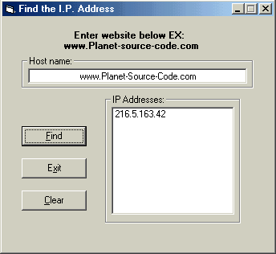



## I\.P\. Address Finder

### Description

The purpose of this program is to find the I.P. address or addresses of webbsites. (this is actually an upgrade of a tutorial)
 
### More Info
 

             |
---                |---
**Submitted On**   |2002-04-06 00:55:14
**By**             |[Dave Kramer](https://github.com/Planet-Source-Code/PSCIndex/blob/master/ByAuthor/dave-kramer.md)
**Level**          |Intermediate
**User Rating**    |5.0 (15 globes from 3 users)
**Compatibility**  |VB 6\.0
**Category**       |[Complete Applications](https://github.com/Planet-Source-Code/PSCIndex/blob/master/ByCategory/complete-applications__1-27.md)
**World**          |[Visual Basic](https://github.com/Planet-Source-Code/PSCIndex/blob/master/ByWorld/visual-basic.md)
**Archive File**   |[I\_P\_\_Addre69284462002\.zip](https://github.com/Planet-Source-Code/dave-kramer-i-p-address-finder__1-33500/archive/master.zip)

